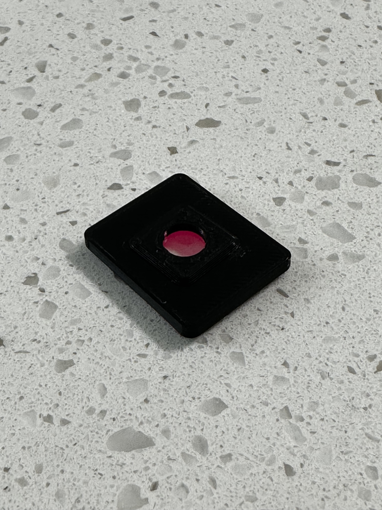
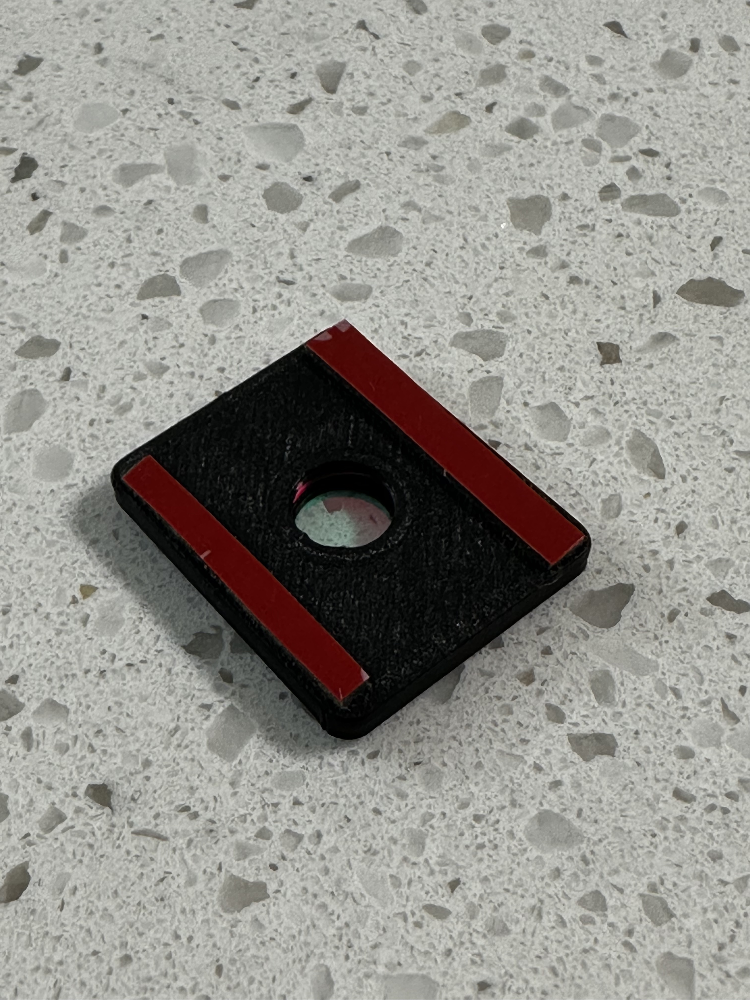
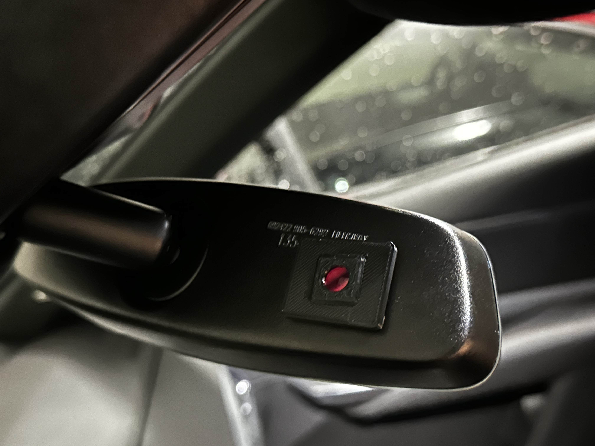

Use with [Gzikai 650nm 10mmx1mm UV AR IR Cut Filter](https://www.amazon.com/dp/B07N2Z9NHL?psc=1&ref=ppx_yo2ov_dt_b_product_details) or similar. Print in a high temp material like ABS or PETG.
Super glue lens holder on body to capture lens, but allow lens to be reused.
Use 3M VHB tape to secure to mirror light sensor.

